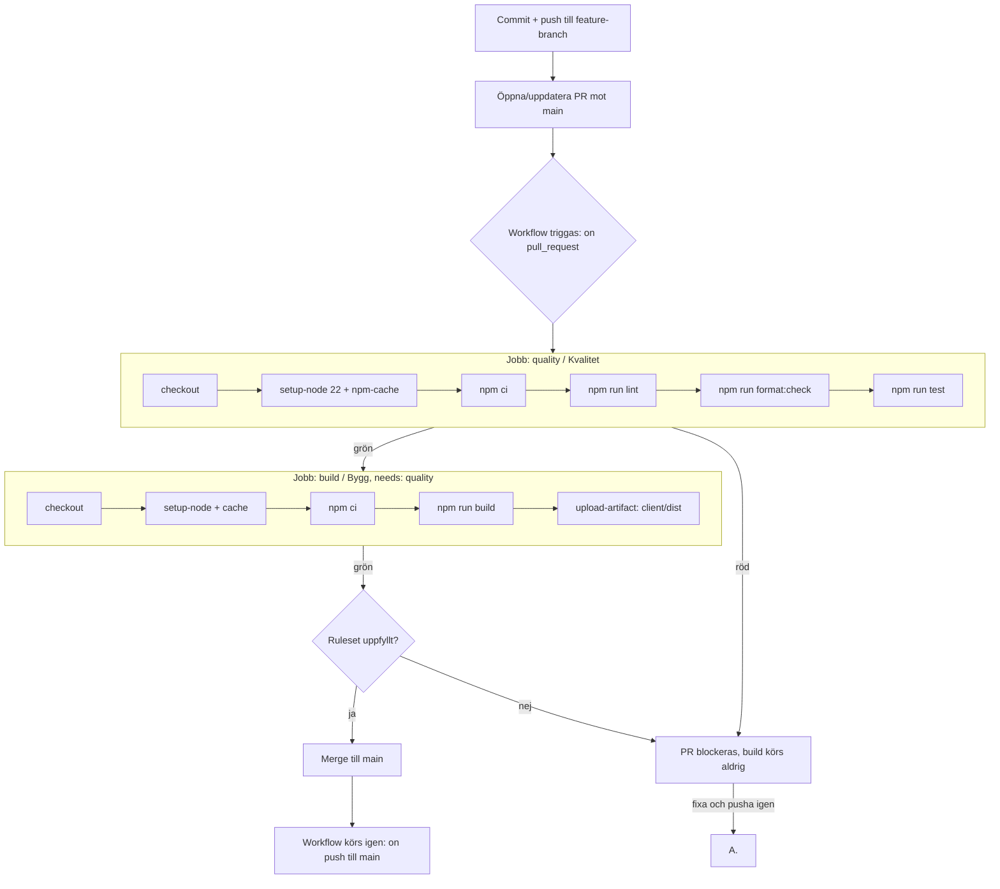

# CI-pipeline

## Flöde: från commit till merge

## Vad varje steg fångar

| Steg | Fångar |
|---|---|
| `npm ci` | Lockfil och `package.json` som inte stämmer överens; garanterar exakta versioner |
| `lint` | Kodproblem och misstänkta mönster (ESLint) |
| `format:check` | Filer som inte följer Prettier. Kontrollerar bara, ändrar aldrig |
| `test` | Regressioner i beteende (Vitest) |
| `build` | Trasiga importer och byggfel som lint och test kan missa |
| Ruleset | Att inget mergas utan PR, review och gröna checks |

## Uppmätta tider (en körning)

## Uppmätta tider (en körning)

Körning: [2026-09-28] · Sekventiell (`needs: quality`): ja

| Steg | Kvalitet | Bygg |
|---|---|---|
| Set up job | 0s | 1s |
| checkout | 1s | 1s |
| setup-node | 1s | 1s |
| `npm ci` | 5s | 5s |
| lint | 2s | – |
| format:check | 0s | – |
| test | 2s | – |
| build | – | 1s |
| upload-artifact | – | 1s |
| Post-steg + Complete job (differens) | 2s | 2s |
| **Jobbtid enligt GitHub** | **13s** | **12s** |

**Total pipeline-tid (vägg-tid):** 30s (jobben summerar till 25s, resten är
uppstart av runners och väntan mellan jobben)

## Ruleset på `main`

Bekräfta uppgifterna med den som ställt in rulesetet:

- Pull request krävs innan merge
- Minst en godkännare
- Required status checks: `Kvalitet` och `Bygg`
- "Require branch to be up to date before merging": ja
- Direktpush till `main` blockerad: ja